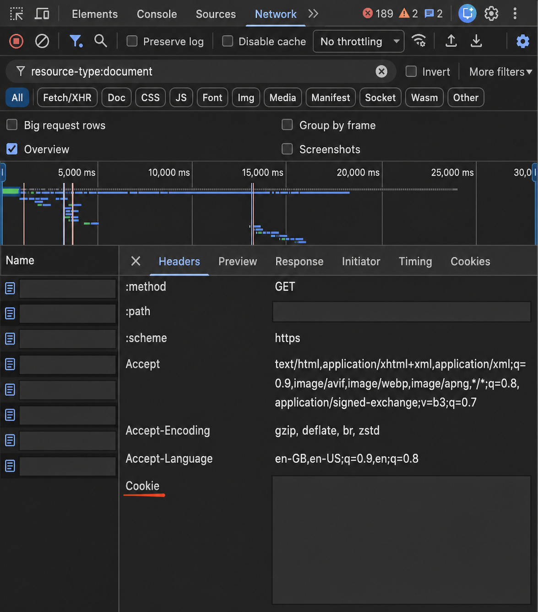

# Fortross LinkedIn Profile API

**[Open the live playground](https://fortross-api.onrender.com/playground)**

## Try it

You need your own signed-in LinkedIn session's Cookie header value. This grants access
to your session, so only submit it to a server you trust. Cookies stay in server memory;
this is not LinkedIn OAuth, and automated access can put your account at risk.

To find it in Chrome, open your LinkedIn profile, open **DevTools → Network**, and reload
the page. Select the profile document request, then **Headers → Request Headers → Cookie**.
Copy the full Cookie value, not the response's Set-Cookie header.



*Illustration with private request names, profile path, and cookie value redacted.*

1. Open **POST /login-with-cookie**, click **Try it out**, and paste the full Cookie value
   into the `cookie` form field. Keep quotes unchanged; no JSON escaping is needed.
2. Copy `access_token`. Click **Authorize**, paste the raw token into **SessionToken**
   without adding `Bearer`, and authorize.
3. Execute **POST /profiles** or **POST /posts** with one of the payloads below.
   Replace `example` with the target profile's slug.
4. Execute **POST /logout** when done. Further use of that token returns 401.
   The Authorize dialog's Logout button alone does not revoke the server session.

**Profile:**

```json
{"url":"https://www.linkedin.com/in/example/","include_sections":false}
```

Use `include_sections:true` to request detail sections too. This costs up to six LinkedIn
GETs instead of one, and unsupported sections can still be empty.

**First-page posts:**

```json
{"url":"https://www.linkedin.com/in/example/","limit":5}
```

The playground documents request/response schemas. The maximum post limit is 50;
results can contain fewer items. For other clients, send `Authorization: Bearer <token>`
on `/profiles`, `/posts`, and `/logout`.

## Before testing

- Login parses the cookie without contacting LinkedIn. `linkedin_session_verified:false`
  is expected; validity is checked when extraction is attempted.
- Tokens expire after one hour by default, or on server restart. Log in again if needed.
- Requests are deliberately rate-limited. Stop on a limit or checkpoint; do not repeatedly retry.
- The free host may take about a minute to wake after idle time. Never share cookies or
  tokens in screenshots, recordings, or issues.

## Run locally

Use Python 3.12 or 3.13 with an activated virtual environment, from the repository root:

```bash
pip install -e '.[dev]'
cp .env.example .env  # Skip if .env already exists.
python -m uvicorn fortross.main:app --host 127.0.0.1 --port 8000 --workers 1 --no-access-log
```

Set `LINKEDIN_LIVE_ENABLED=true` in `.env` before starting if you want live extraction.
Leave it false for login/logout-only tests. Do not add LinkedIn credentials to `.env`.
The local playground is at `http://127.0.0.1:8000/playground`.

## Approach and limitations

Direct HTTPS requests fetch LinkedIn profile/detail documents and the initial posts feed.
The parser decodes HTML/SDUI data and Voyager feed references into structured JSON,
including grouped experience and reposts. No browser runs in the backend.

The hosted service has passed a maintainer smoke test. About, education, skills,
certifications, and languages remain incompletely verified; null/empty fields and warnings
do not prove the source profile has no data. Posts are first-page-only, with no 30-day
filter or guaranteed exact timestamps. LinkedIn changes can break extraction.

SQLite stores safety counters only, not credentials or results. Free-host restarts can
erase those counters; sessions are memory-only and are also lost on restart.